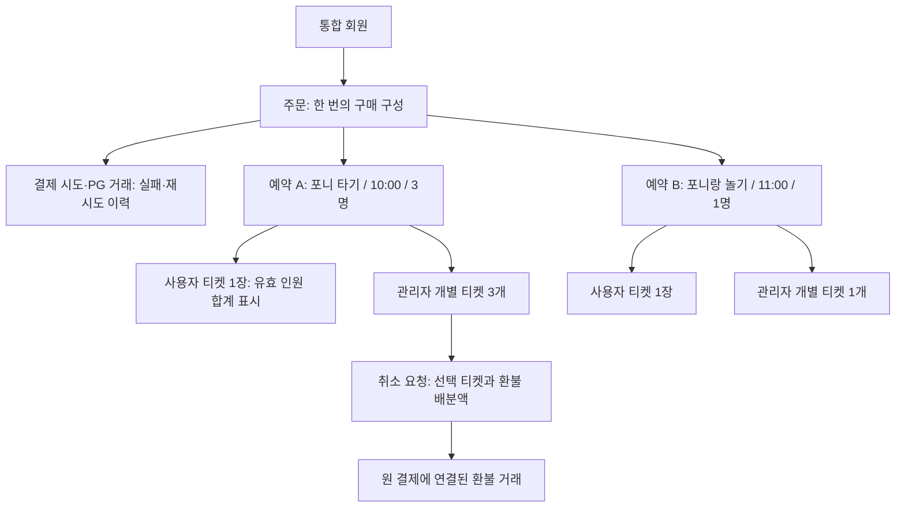

# 렛츠런파크 — 기획자가 결정해야 할 개발 검토 사항

작성 기준: 2026.08.28 · 기능 명세서 v1.0 보완 · 내부 기획·개발 협의용

> 이 문서는 확정된 추가 개발 범위가 아닙니다. 기존 요구사항을 구현하려면 어떤 정책·예외·운영 기준을 정해야 하는지 정리한 검토안입니다. ‘제안’은 승인 전 확정값이 아니며, 구현 방식·공수는 개발팀 검토 후 확정합니다.

## 1. 기획자가 먼저 잡아야 할 기준

화면에 버튼을 넣는 것만으로 기능이 완성되지는 않습니다. **누가 / 어떤 데이터에 / 어느 상태에서 / 어떤 행동을 / 실패하면 어떻게** 할 수 있는지를 함께 정의해야 합니다. 기획자는 사용자와 운영자의 기대 결과를 정하고, 개발자는 그 결과를 보장할 데이터·API·동시 처리 방식을 설계합니다.

### 개발 착수 전에 먼저 결정할 여섯 가지

| 우선 질문 | 결정하지 않으면 생기는 문제 | 연결 항목 |
| --- | --- | --- |
| 장바구니와 결제 중 언제 정원을 확보할까? | 마지막 한 자리를 두 명이 동시에 결제하거나 장바구니만으로 매진됨 | D-06 |
| 여러 상품 중 하나가 마감되면 주문 전체를 멈출까? | 사용자가 동의하지 않은 상품 구성·금액으로 결제됨 | D-06·D-07 |
| 취소 처리 중에는 입장·시간 점유·재판매를 어떻게 할까? | 환불 중인 티켓으로 입장하거나 같은 자리를 다시 판매함 | D-03·D-06 |
| 할인된 인원 중 한 명을 취소하면 얼마를 돌려줄까? | 사용자 안내·PG 취소액·정산 자료가 서로 달라짐 | D-04·D-10 |
| 사용자도 인원을 골라 직접 부분취소할 수 있을까? | 관리자 기능만 구현했는데 사용자 화면도 추가로 필요해짐 | D-03 |
| 서로 다른 부서의 상품을 어느 PG 계약으로 한 번에 결제할까? | 일괄결제·부서 권한·정산·향후 PG 전환 설계가 충돌함 | D-07·D-11 |

## 2. 주문·예약·티켓은 다른 관리 단위다

**논의된 요구:** 사용자는 상품·날짜·회차별 한 장, 관리자는 인원별 한 장을 봅니다. 다음은 이를 위한 논리 설계안이며 실제 테이블을 지정하는 문서는 아닙니다.

### 기획에서 명확히 해야 할 것

- 주문번호, 회차별 예약번호, 인원별 티켓번호, PG 거래번호를 구분합니다. 고객 문의에서는 예약번호로 관련 주문·환불까지 찾을 수 있어야 합니다.
- ‘개별 티켓’은 참석자 이름이 없어도 번호로 관리할 수 있습니다. 실명·생년월일 수집은 별도 필요성과 수집 범위를 확인합니다.
- 사용자 티켓은 별도 예약을 복제한 것이 아니라 개별 티켓의 유효 인원을 모아서 보여주는 화면으로 설계합니다.
- **추가 인원 구매:** 결제 전에는 장바구니 인원을 수정할 수 있지만, 결제 후 같은 회차에 인원을 추가하는 방식은 아직 정하지 않았습니다. 기존 예약 인원 변경인지, 취소 후 재예약인지 결정해야 합니다. 중복 검사에 예외를 임의로 만들지 않습니다.
- **일정 변경:** 예약 시간 이동은 단순 글자 수정이 아닙니다. 새 회차 정원·중복 시간·가격 차이·기존 티켓·환불을 함께 처리해야 하므로 직접 변경 기능 제공 여부를 먼저 정합니다.

**개발팀 요청 산출물:** 논리 데이터 관계도, 주요 식별자 정의, 실제 결제금액·할인·취소 정책의 구매 시점 기록, 상태 전이표.

**검수:** 3명과 다른 회차 1명을 함께 구매하면 주문 1건·회차 예약 2건·사용자 티켓 2장·관리자 티켓 4개가 서로 연결됩니다.

## 3. 중복 예약 방지와 정원 초과 방지는 따로 검수한다

같은 계정이 겹치는 시간을 예약하는 문제와, 서로 다른 계정이 마지막 자리를 동시에 구매하는 문제는 다릅니다. 두 조건을 모두 서버에서 보장해야 합니다.

### A. 회원의 시간 중복 — D-02·D-09

- 기준은 인증된 통합 회원 ID입니다. 화면에서 선택한 닉네임·전화번호 문자열·기기 저장값만 기준으로 삼지 않습니다.
- 같은 회원의 유효 예약과 장바구니를 확인합니다. 결제 대기 예약이 시간을 차지하는지도 정해야 합니다.
- **판정:** 시작 A가 종료 B보다 이르고, 시작 B가 종료 A보다 이르면 중복입니다. 시작 시각만 같을 때 막는 것으로는 부족합니다.
- 10:00~10:20과 10:20~10:40의 연속 이용, 이동·준비시간, 다른 지역 간 적용은 최종 정책으로 정합니다. 표시와 계산의 기준 시간대는 한국 운영 기준으로 통일하는 안을 확인합니다.
- 인원 3명 중 1명을 취소해도 2명이 남으면 해당 시간은 계속 점유합니다.
- 네이버·카카오를 별도 회원으로 두면 같은 사람이 서로 다른 계정으로 예약할 수 있습니다. **계정 기준 제한은 동일인 전체 제한과 다릅니다.** 동일인 통합을 원하면 연결·본인 확인 정책이 추가로 필요합니다.

### B. 회차의 정원 — D-01·D-06

| 확인할 상황 | 기획에서 정할 결과 | 개발에서 보장할 것 |
| --- | --- | --- |
| 마지막 1자리에 두 회원이 동시에 결제 | 한 회원만 확정, 다른 회원에게 마감 안내 | 정원 확인과 점유를 동시에 처리해 초과 판매 방지 |
| 같은 계정이 두 기기에서 겹치는 회차 결제 | 하나만 유효하게 확정 | 계정 단위 경쟁 처리와 중복 검사 |
| 서로 다른 상품이 같은 말·공간·인력을 사용 | 상품별 독립 정원인지 공통 정원인지 결정 | 공통 자원이면 상품을 넘는 정원 제한 |
| 온라인·현장 각각 판매 | 온라인 한도와 현장 한도를 운영자가 관리 | 키오스크 미연동 전제 유지, 잔여석 실시간 공유로 오해하지 않도록 안내 |

**개발팀 요청:** 동시에 들어온 요청의 처리 기준, 실패 응답과 재조회 방식, 부하 테스트 시나리오. DB 잠금·트랜잭션 등 구체적인 구현은 개발팀이 선택합니다.

## 4. 장바구니에 담긴 좌석은 언제까지 유효한가 — D-06

| 선택지 | 장점 | 주의점 |
| --- | --- | --- |
| 장바구니 담기부터 정원 확보 | 결제 단계에서 마감될 가능성이 줄어듦 | 오래 담아둔 항목 때문에 실제 구매 없이 매진될 수 있음 |
| 결제 시작 시 일정 시간 확보 | 쇼핑은 자유롭게 하고 결제 중 보호 가능 | 만료·연장·이탈·늦은 승인 처리 설계 필요 |
| 결제 확정 직전만 확보 | 정원 잠김이 적음 | 결제 진행 중 마감될 수 있어 승인·취소 보상 처리 필요 |

**검토 제안:** 장바구니는 보관만 하고, 결제 시작 시 주문의 회차 정원과 회원 시간 구간을 제한 시간 동안 확보하는 안부터 검토합니다. 확보 시간은 임의로 5분·10분 등으로 확정하지 않고 PG 흐름·현장 운영을 보고 정합니다.

기획자가 결정할 항목:

- 장바구니 저장 기간과 계정 변경 시 분리 방식.
- 결제 대기 시간, 남은 시간 표시, 연장 허용 여부, 로그인 만료 시 안내.
- 주문 여러 항목 중 하나라도 확보 불가할 때 전체 중단 여부. **제안:** 전체를 멈추고 수정 요청. 가능한 항목만 자동 결제하지 않음.
- 이탈·대기 만료 시 좌석과 계정 시간을 해제하는 조건.
- **PG 결과를 모르는 상태에서는 단순 시간 만료만으로 실패를 확정하지 않음.** 먼저 거래 조회로 결과를 확인하고, 늦은 성공의 예약 복구 또는 승인 취소 기준을 마련합니다.
- 가격·할인·회차가 변경되면 변경 내역을 표시하고 다시 동의를 받습니다.

**필요한 화면:** 장바구니 품절 표시, 가격 변경 안내, 결제 준비 중, 확보 시간 만료, 결과 확인 중, 주문 재개.

## 5. 결제 성공 화면과 실제 결제 성공은 다르다 — ORD-02·D-06·D-11

**제안하는 정상 흐름:** 서버에서 가격·정원·권한·중복 확인 → 주문 및 결제 시도 기록 → PG 결제 → 서버에서 승인 결과 확인 → 예약·티켓 확정 → 완료 화면.

PG 결제와 우리 DB 저장은 서로 다른 시스템에서 일어납니다. 한쪽만 성공한 상황을 사용자 화면·관리자 복구 절차에 포함해야 합니다.

| 상황 | 사용자에게 보여줄 것 | 필요한 처리·검수 |
| --- | --- | --- |
| 결제 버튼 두 번 누름·새로고침 | 같은 주문의 진행 상태 | 같은 시도는 한 번만 청구·발급. 버튼 비활성화만으로 해결하지 않음 |
| PG 승인됐지만 완료 화면을 못 봄 | 주문 내역에서 결과 확인 | 완료 페이지 방문 여부와 무관하게 승인 결과 반영 |
| 승인 요청 후 응답이 늦음 | 결과 확인 중, 중복 결제 주의 | 조회 후 성공·실패 판단. 새 주문으로 곧바로 재결제 유도하지 않음 |
| PG 성공 후 예약 저장 실패 | 자동 완료로 표시하지 않고 확인 필요 | 재처리로 예약 복구하거나 원 승인 취소. 담당자·처리 기한 결정 |
| 서버 통지가 중복·뒤늦게 도착 | 최신 상태 유지 | 이벤트 중복 처리 방지, 과거 상태로 되돌리지 않음 |
| 결제 대기 만료 직후 늦게 승인 | 결과 확인 안내 | 정원·시간 재검증 후 복구 또는 승인 취소, 초과 발급 금지 |

**개발 용어:** 멱등성은 같은 요청이 여러 번 와도 한 번 처리한 결과를 유지하는 성질입니다. 주문·결제 시도·환불 요청의 고유 식별자가 필요합니다. PG의 멱등키 지원과 내부 중복 방지는 함께 검토합니다. 토스페이먼츠 취소 문서에서도 멱등키를 통한 중복 취소 방지를 안내합니다. [공식 취소 문서](https://docs.tosspayments.com/guides/v2/cancel-payment)

**연동 확인:** 웹훅은 PG가 서버로 결과를 보내는 통지입니다. 어떤 결제·취소에 통지가 오는지는 PG마다 확인해야 합니다. 토스페이먼츠도 결제창 닫기는 상태 변경 통지가 없고, 취소 전용 이벤트의 대상이 제한되어 있습니다. 따라서 ‘모든 취소는 웹훅만 기다리면 된다’고 설계하지 않습니다. 통지 검증·거래 조회·재처리를 함께 정의합니다. [공식 웹훅 이벤트 문서](https://docs.tosspayments.com/reference/using-api/webhook-events)

위 공식 문서는 기술 검토 참고 사례이며 **위이의 실제 PG가 토스페이먼츠로 확정되었다는 의미가 아닙니다.** 실제 PG·계약 MID·지원 수단·부분취소 조건을 받아 다시 검토합니다. 계좌이체 제외 방향은 유지합니다.

## 6. 부분취소는 인원·금액·입장·정원을 함께 바꾸는 작업이다 — D-03~D-06

### 기획자가 정할 환불 정책

- 사용자 직접 부분취소 허용 여부. 관리자 개별 취소는 논의된 요구사항입니다.
- 일반 인원과 할인 인원을 구분해 취소할지, 지정 인원 없이 수량만 줄일지.
- 인원 감소로 할인 조건이 깨졌을 때 기존 할인 유지 또는 재계산 여부.
- 수수료, 원 단위 배분·반올림, 운영사 취소의 별도 환불 기준.
- 부분 입장 또는 사용 완료된 인원의 취소 허용 여부와 예외 승인 권한.
- 사용자 취소 마감은 화면을 연 시점인지 서버 요청 접수 시점인지. **제안:** 서버 접수 기준을 명확히 고지하고 지연 상황을 검수.

### 계산 예시 — 실제 가격·할인 정책이 아닌 설명용 가정

일반 2명×5,000원 + 할인 1명×4,000원 = 14,000원을 결제했다고 가정합니다. 구매 당시 배분액을 유지하고 수수료가 없다면 일반 티켓 1개 취소는 5,000원, 할인 티켓 1개 취소는 4,000원입니다. 할인 재계산 정책이라면 결과가 달라질 수 있으므로 **‘한 명 취소’만으로 환불액이 결정되지 않습니다.**

### 상태를 나눠서 결정한다

| 관리 축 | 상태 예시 | 주의할 점 |
| --- | --- | --- |
| 결제 | 승인 대기·승인 완료·결과 확인 필요·실패 | 결제 성공과 예약 발급 완료는 별개 |
| 개별 티켓 | 유효·취소 처리 중·취소 완료 | 묶음 티켓의 남은 인원에 반영 |
| 환불 | 요청·처리 중·PG 취소 완료·실패·확인 필요 | PG 취소 완료와 고객 카드·계좌 반영 시점은 구분 |
| 입장 | 입장 전·일부 사용·전체 사용 | 시간상 입장 가능 표시만으로 사용 기록을 대신하지 않음 |
| 정원·계정 시간 | 점유·해제 | 티켓 무효화·환불·입장 상태와 연결하되 해제 시점 명시 |

**처리 중 상태 검토안:** 취소 중인 대상 티켓은 입장을 제한하고, PG 결과가 불명확한 동안 정원·계정 시간은 보수적으로 유지합니다. 취소 확정 시 해제하고, 명확한 실패 시 티켓을 복구하는 방식부터 검토합니다. 운영사 휴장처럼 환불 실패와 관계없이 서비스 제공이 불가능한 경우에는 예약 취소를 유지하고 환불만 재처리하는 별도 기준이 필요합니다. 이 내용은 D-06 승인 후 본 명세에 반영합니다.

PG가 취소를 처리한 시점과 구매자의 환불 반영 시점은 결제 수단에 따라 다를 수 있으므로 ‘즉시 입금 완료’로 일괄 안내하지 않습니다. 실제 제공 수단의 안내 문구는 계약 PG 기준으로 확정합니다. [공식 취소 처리 안내 사례](https://docs.tosspayments.com/guides/v2/cancel-payment)

**개발 검수:** 같은 티켓 동시 취소, 두 관리자의 서로 다른 티켓 동시 환불, 부분환불 후 전체환불, 남은 환불 가능 금액 초과, 이미 사용한 티켓 취소를 확인합니다.

## 7. 사용자 티켓 한 장으로 실제 입장은 어떻게 확인할까 — D-05

움직이는 티켓 화면은 시각적 확인 장치입니다. 실제 사용 처리와 중복 입장 방지는 별도로 설계해야 합니다.

| 기획 질문 | 선택에 따라 달라지는 개발 |
| --- | --- |
| 3명이 반드시 함께 들어오는가, 나눠서 들어올 수 있는가? | 일괄 사용 처리 또는 인원별 사용·남은 인원 관리 |
| QR 스캔인가, 직원이 번호로 조회하는가? | 스캔/조회 화면, 권한, 기기, 인식 실패 대안 |
| 사용 처리를 잘못 눌렀을 때 되돌릴 수 있는가? | 복구 권한·사유·기록, 악용 방지 |
| 현장에서 할인 증빙을 못 보여주면 어떻게 하는가? | 입장 거절·예약 취소·차액 결제 중 정책 선택. 차액 결제는 자동 포함하지 않음 |
| 통신이 끊긴 현장에서는 어떻게 운영하는가? | 현장 수기 확인·사후 대조 또는 별도 오프라인 기능 검토 |

**산출물:** 입장 담당자용 최소 화면, 유효·취소·이미 사용·시간 전후의 안내 문구, 부분 입장 예시, 현장 장애 매뉴얼. QR·오프라인·차액 결제는 아직 확정된 기능으로 간주하지 않습니다.

## 8. 관리자 권한은 버튼보다 데이터 범위가 중요하다 — D-08

**논의된 방향:** 지역 → 부서 → 프로그램, 타 부서 프로그램 조회 가능, 수정·삭제는 담당 부서만. 여기서 ‘조회’가 예약자 이름·전화번호·매출·환불까지 포함하는지는 따로 정합니다.

**기획 산출물:** 역할 × 데이터 × 행동의 권한표. 행동은 조회·생성·변경·취소·환불·다운로드·권한 부여를 나눕니다. 개인정보 마스킹 여부와 전체 관리자·위이 운영자의 범위도 적습니다.

| 예외 상황 | 요구할 기준 |
| --- | --- |
| 한 주문에 서로 다른 부서의 상품이 있음 | 담당 티켓만 취소 가능. 다른 부서 상품·개인정보·총액 표시 범위 결정 |
| 사용자가 다른 예약번호를 직접 입력 | 서버에서 본인 소유 여부 확인 |
| 관리자 소속 변경·퇴사·권한 회수 | 이미 로그인한 세션에도 권한 변경 반영 기준 결정 |
| 매출 자료 다운로드 | 소속 범위·개인정보 항목·기간을 검사하고 다운로드 이력 기록 |
| 큰 규모의 일괄 취소 | 영향 예약·금액 미리보기, 재확인, 사유, 필요 시 별도 승인 |

메뉴를 숨기는 것만으로 접근을 막았다고 보지 않습니다. 모든 요청에서 해당 데이터에 대한 권한을 확인하는 원칙은 OWASP 공식 권한 가이드에서도 권고합니다. [OWASP Authorization Cheat Sheet](https://cheatsheetseries.owasp.org/cheatsheets/Authorization_Cheat_Sheet.html)

## 9. 운영 중 바뀌는 값과 과거 예약을 구분한다 — D-01·D-10

- 상품의 새 가격·할인·취소 정책을 저장해도 과거 구매 금액과 적용 정책은 바뀌지 않도록 구매 당시 내용을 보관하는 안을 검토합니다.
- 이미 판매된 회차를 시간 변경하면 중복 예약·사용자 동의·안내·취소까지 영향을 받습니다. 예약 존재 시 변경 제한, 새 회차 생성, 별도 변경 절차 중 하나를 정합니다.
- 예약된 인원보다 정원을 낮추는 경우를 막을지, 초과 상태로 표시하고 운영자가 해소할지 정합니다.
- 상품 비활성·품절·운영 기간 종료·현장만 운영은 각각 노출과 신규 판매 가능 여부가 다릅니다. 기존 예약 조회·취소까지 숨기면 안 됩니다.
- 휴장 일괄 취소는 한 번에 성공하지 않을 수 있습니다. 성공·실패·처리 중 건수와 재처리 대상 목록이 필요합니다.
- 노쇼, 현장 운영 종료 후 미사용 티켓의 상태, 예외 환불을 어떻게 처리할지 운영 기준을 확인합니다.

**기획 산출물:** 프로그램 설정 항목표, 변경 가능 조건, 기존 예약 영향 안내, 운영사 취소 시나리오.

## 10. 정산과 PG 전환은 주문 구조에 영향을 준다 — D-07·D-10·D-11

1. 주문 전체가 아니라 예약 항목·개별 티켓의 부서 귀속과 실제 결제·환불 금액을 추적합니다.
2. 결제일·이용일·취소일 중 어느 기준으로 집계할지 정합니다. 월말 결제 후 다음 달 부분환불 사례를 양사 회계 담당과 계산해봅니다.
3. 매출·할인·PG 수수료·취소 수수료·환불·정산 대상액을 구분하고 화면과 다운로드의 산식을 맞춥니다. 세금계산서 발행 주체·금액·시점은 회계 확인 전 확정하지 않습니다.
4. 한 번 결제할 수 있는 상품 조합은 실제 PG 계약·MID별 제약을 확인해야 합니다. 지역·부서별 계약이 나뉘어도 일괄결제가 그대로 가능한지 가정하지 않습니다.
5. **PG 전환 후 과거 거래 환불:** 신규 결제를 새 PG로 보내더라도 기존 주문은 원래 결제한 PG·거래로 환불해야 하는지 계약·기술 조건을 확인합니다. 구 PG 접근 유지 기간과 담당자도 필요합니다.
6. 정산 자료 다운로드와 자동 송금은 다릅니다. 자동 송금은 현재 명세 범위에 포함되어 있지 않습니다.

**기획자가 준비할 예시:** 정상 결제, 1명 부분환불, 여러 번 부분환불, 다음 달 환불, 운영사 일괄 취소, 부서 혼합 주문, PG 전환 전 거래 환불. 실제 정산 양식으로 기대 금액을 먼저 작성합니다.

## 11. 오류 화면·알림·개인정보·운영 품질도 명세에 넣는다

### 오류가 났을 때 다음 행동까지 안내 — D-06·D-12

| 화면 상황 | 문구 예시 | 가능한 다음 행동 |
| --- | --- | --- |
| 기존 예약과 시간이 겹침 | 이미 예약한 시간과 겹칩니다. 다른 회차를 선택해주세요. | 겹치는 본인 예약 확인·다른 시간 선택 |
| 장바구니 상품 마감 | 선택한 회차가 마감되었습니다. | 해당 항목 수정·삭제, 다른 항목은 보존 |
| 금액 변경 | 선택 후 금액이 변경되었습니다. 변경 내용을 확인해주세요. | 변경 전후 금액 확인·다시 동의 |
| 결제 결과 불명확 | 결제 결과를 확인하고 있습니다. 중복 결제하지 말고 주문 내역을 확인해주세요. | 결과 재조회·문의 |
| 환불 처리 중 | 취소 요청을 접수했습니다. 처리 결과는 예약 내역에서 확인해주세요. | 요청 내역·진행 상태 확인 |

문구는 예시이며 고객사 검토 후 확정합니다. 관리자용 오류에는 주문/예약 식별자·재조회·재처리·문의 경로를 제공하되 비밀키나 불필요한 개인정보는 표시하지 않습니다.

예약·취소·운영 변경 알림은 발송 채널·대상·시점·실패 재시도·비용을 정합니다. 알림 발송 실패와 예약·환불 실패는 분리합니다. 알림이 안 갔다고 예약을 자동 취소하지 않습니다.

### 개인정보와 운영 품질 — D-09·D-13·D-14

- 회원·예약자·참석자별 수집 항목, 이용 목적, 필수/선택, 접근 대상, 보관·삭제 기준을 표로 작성합니다. 보관 기간과 법적 근거는 고객사 담당자 검토로 정하며 여기서 임의의 기간을 확정하지 않습니다.
- 회원 탈퇴 시 향후 예약·환불·과거 정산 기록을 어떻게 처리할지 정합니다. 사용자의 계정 삭제와 거래 이력 삭제를 동일하게 취급하지 않습니다.
- 실제 개인정보·결제키를 테스트 데이터로 배포하지 않습니다. 운영과 테스트 계정·PG 환경·데이터를 구분합니다.
- 예약 오픈 순간 예상 접속자와 동시 결제 수, 허용 응답시간, 장애 알림 담당, 지원 브라우저·모바일 화면을 합의합니다. 성능 수치는 트래픽 근거 없이 확정하지 않습니다.
- 화면 확대·키보드 조작·상태를 색상만으로 구분하지 않는 표시·오류 안내를 검수 항목으로 넣습니다.
- 백업 존재 여부뿐 아니라 복구 가능한지 검증합니다. 허용 데이터 손실 시간·복구 목표 시간·현장 대체 운영·담당 연락망을 정합니다.
- 오픈 중단 시 신규 판매만 막고 기존 티켓 조회·취소·환불은 어떻게 유지할지 정합니다.

## 12. 기존 결정 목록에서 더 세분화할 질문

기능 명세의 D-01~D-14는 유지합니다. 아래는 이번에 드러난 추가 질문이며 **기능 추가 확정 또는 견적 제외 선언이 아닙니다.**

| 검토 ID | 질문 | 연결·승인 주체 |
| --- | --- | --- |
| P-01 | 결제 후 인원 추가·회차 변경을 직접 지원할까, 취소 후 재예약으로 운영할까? | D-01·D-02·D-03 / 마사회 운영·위이 기획 |
| P-02 | 장바구니 일부 마감·승인 후 저장 실패·늦은 승인 때 주문을 어떻게 복구할까? | D-06·D-07 / 위이 기획·개발, 마사회 운영 확인 |
| P-03 | 함께 예약한 인원의 나눠 입장·사용 취소·할인 증빙 실패·노쇼를 어떻게 처리할까? | D-04·D-05 / 마사회 현장 운영 |
| P-04 | 판매된 회차·정원·정책 변경과 PG 전환 이후 과거 주문은 어떻게 처리할까? | D-01·D-10·D-11 / 마사회 운영·회계, 위이 개발 |

### 승인 기록 양식

각 결정에는 **정책 ID / 질문 / 선택안 / 승인값 / 승인 담당 / 승인일 / 적용 시작일 / 기존 예약 처리 / 관련 화면·API / 검수 사례**를 남깁니다. 담당 조직은 역할 기준 제안이며 실제 승인자는 지정해야 합니다.

## 13. 개발팀에 넘길 기획 산출물과 진행 순서

| 순서 | 기획자가 준비할 것 | 개발팀과 함께 확인할 것 |
| --- | --- | --- |
| 1. 정책·연동 확인 | 상품 운영값, D-01~D-11 우선 결정, 실제 PG·로그인 앱·정산 양식 | 구현 가능 여부·PG 제약·미정 항목의 일정 영향 |
| 2. 데이터·상태 합의 | 주문/예약/티켓 정의, 환불 예시, 권한표, 상태 전이표 | 동시 처리·재시도·복구·보관 방식 |
| 3. 화면 상세 | 정상·빈 화면·마감·오류·처리 중·권한 없음 화면과 문구 | 서버 응답과 버튼/상태의 연결 |
| 4. 통합 개발·검수 | 기능 명세 AT-01~AT-14와 아래 확장 사례의 기대 결과 | 테스트 PG·실제 서버·동시 요청·운영 복구 검증 |
| 5. 오픈 승인 | 운영 매뉴얼·담당자·대상 상품·CTA·정책 승인 기록 | 도메인·로그인·결제·모니터링·복구·고객사 승인 |

구체적인 API 경로·DB 엔진·락 방식·서버 규모는 이 문서에서 지정하지 않습니다. 개발팀은 **필요 입력 / 인증·권한 / 검증 규칙 / 성공 결과 / 오류 결과 / 재시도 방식**을 API별로 제시하고 기획자는 화면·정책과 일치하는지 확인합니다.

### 추가 통합 검수 체크리스트

- [ ] X-01. 서로 다른 회원이 마지막 한 자리를 동시에 결제해도 초과 판매하지 않는다.
- [ ] X-02. 동일 회원이 두 기기에서 겹치는 시간을 동시에 결제해도 하나만 확정된다.
- [ ] X-03. 장바구니 일부 마감·가격 변경 시 동의 없이 상품 구성·금액을 바꾸지 않는다.
- [ ] X-04. 결제창 닫기·새로고침·응답 지연·중복 통지 후에도 결제·예약을 조회로 복구할 수 있다.
- [ ] X-05. 정원 확보 만료와 늦은 PG 승인이 겹쳐도 초과 발급·중복 청구하지 않는다.
- [ ] X-06. PG 승인 후 DB 저장 실패 시 예약 복구 또는 승인 취소가 추적 가능하다.
- [ ] X-07. 일반/할인 티켓을 여러 번 취소해도 환불 누계·남은 금액·정산 자료가 일치한다.
- [ ] X-08. 두 관리자가 같은 티켓 또는 같은 주문의 서로 다른 티켓을 취소해도 중복환불하지 않는다.
- [ ] X-09. 취소 처리 중·부분 입장·이미 사용·운영사 휴장에 승인된 입장·재판매 정책이 적용된다.
- [ ] X-10. 다른 예약번호·부서로 요청을 바꿔도 개인정보 조회·취소·다운로드 권한을 넘을 수 없다.
- [ ] X-11. 정책·가격·회차 변경 후 과거 예약의 구매 당시 금액과 승인된 처리 기준을 유지한다.
- [ ] X-12. 다음 달 환불·PG 전환 전 거래 환불·알림 실패·서버 복구를 운영자가 처리할 수 있다.

### 완료 기준

- [ ] 주요 정책과 예외 처리의 승인 담당·값이 기록되어 있다.
- [ ] 사용자 화면·관리자 화면·서버 상태·PG 거래·정산 자료의 결과가 일치한다.
- [ ] 미정 항목을 구현 완료로 표시하지 않으며, 오픈에 영향이 있는 항목은 승인 전 공개하지 않는다.
- [ ] 현재 시연의 자동 테스트 통과와 실제 로그인·PG·관리자 통합 검수 완료를 구분한다.

## 14. 근거와 적용 범위

기본 요구사항은 기능 명세서 v1.0, 사용자가 제공한 회의 정리, 이후 대화의 결정에 근거합니다. 이번 문서의 흐름·상태·예외 처리 제안은 기획·개발 검토를 위해 추가한 것입니다.

기존 노션 미팅 아젠다의 취소 10분 전·온라인 50%·익월 10일 정산·PG 전환·세금계산서 문구는 당시 논의 자료입니다. 최신 회의 정리와 명세에서 협의로 남겨둔 값은 아젠다만 보고 확정으로 되돌리지 않습니다. 문서 간 차이는 D-01·D-03·D-10·D-11에서 재확인합니다.

외부 기술 문서는 PG 취소·통지·권한 설계를 검토하기 위한 공식 참고자료입니다. 특정 PG 채택, 실제 계약 조건 또는 법률·회계 판단의 근거로 대신하지 않습니다.
