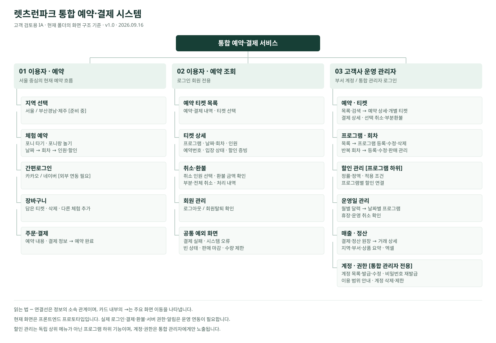

# 렛츠런파크 통합 예약·결제 시스템 전체 IA

v1.1 · 2026-09-16

## 작성 기준

- 최신 화면을 최우선 기준으로 요구사항·명세와 맞춘 전체 IA다. 현재 화면의 존재는 실서비스 개발 완료 또는 정책 승인을 의미하지 않는다.
- 화면 ID는 이 문서에서 새로 부여했다. 동일 파일 안의 화면 전환·팝업·패널·버튼을 구분하며, 행 수를 독립 페이지 수나 개발 공수로 해석하지 않는다.
- 메뉴 계층은 영역 → 1Depth → 2Depth로 정리했다. 탭·서브 플로우 및 동작은 설명 열에 기재했다. 이용자 예약과 예약 조회는 같은 서비스의 두 흐름이다.
- 프로그램 선택·날짜·회차·인원·할인은 현재 하나의 예약 화면 안에 있다. 별도 상품 목록 페이지를 새 화면으로 산정하지 않았다.
- 서울·부산경남·제주는 통합 회원 기반 확장 범위다. 부산경남·제주 파일은 준비 중 안내이며 공개 배포 목록에 포함된다.
- 계정·권한은 고객사 운영 관리자 안에 포함된 메뉴이며 통합 관리자 권한에서만 노출된다.

## 주요 이용 흐름

- 예약: 체험·날짜·회차·인원·할인 선택 → 로그인 → 장바구니 또는 바로 예약 → 예약 내용 확인 → 결제 → 예약 완료 → 티켓 확인
- 조회·취소: 예약 조회 → 티켓 목록 → 티켓 상세 → 입장 상태 확인 또는 인원 선택 취소 → 환불 내역
- 운영: 관리자 로그인 → 프로그램 등록 → 회차 등록 → 운영일 확인 → 예약·티켓 처리 → 매출·정산

로그인은 미인증 회원에게 필요한 시점에 제공한다. 운영 화살표는 대표 업무 순서이며 각 메뉴는 병렬이다.

## 상세 IA

현재는 프로토타입 화면 존재를 뜻한다. 연동 필요·정책 확인·준비 중은 운영 완료를 뜻하지 않는다. 화면 ID는 본 문서에서 부여했다.

| 화면 ID | 영역 | 1Depth | 2Depth / 화면 | 표현 형태 | 상태 | 근거 파일 / 위치 | 화면 정의·세부 사항 |
| --- | --- | --- | --- | --- | --- | --- | --- |
| USR-01 | 이용자 | 지역 선택 | 서울 | 화면 | 현재 | index.html | 체험 예약 진입. 포니 타기·포니랑 놀기 선택과 예약 옵션을 한 화면에 제공 |
| USR-02 | 이용자 | 지역 선택 | 부산경남 / 제주 | 화면 | 준비 중 | busan.html / jeju.html | 준비 중 안내. 지역별 실제 예약은 확장 범위 |
| USR-03 | 이용자 | 체험 예약 | 체험·날짜·회차 선택 | 화면 내 영역 | 현재 | index.html / app.js | 프로그램별 운영일·판매 상태·잔여 수량 안내 |
| USR-04 | 이용자 | 체험 예약 | 인원·할인 선택 | 화면 내 영역 | 현재 | index.html / app.js | 구매 수량, 정가·할인 인원 및 결제 예정 금액 확인 |
| USR-05 | 이용자 | 회원 인증 | 카카오 / 네이버 로그인 | 팝업 | 현재·연동 필요 | index.html #login-dialog | 예약 진행·장바구니·예약 조회 시 인증. 현재는 모의 로그인 |
| USR-06 | 이용자 | 장바구니 | 담은 티켓 확인·삭제 | 화면 | 현재 | index.html ?view=cart | 동일 이용일·지역·부서의 1명 카드를 확인·삭제. 같은 회차 반복 담기 허용 |
| USR-07 | 이용자 | 주문·결제 | 예약 내용 / 결제 정보 | 화면 | 현재·연동 필요 | index.html / app.js | 선택 티켓과 최종 금액 확인 후 결제. 실제 PG 결제창·승인은 연결 필요 |
| USR-08 | 이용자 | 주문·결제 | 예약 완료 | 화면 | 현재 | index.html / app.js | 한 결제의 공통 예약번호, 결제금액, 신규 카드별 하위 티켓 표시 |
| USR-09 | 이용자 | 예약 조회 | 예약 티켓 목록 | 화면 | 현재 | index.html #my-tickets-screen | 로그인 회원의 예약·결제 내역과 티켓 선택 |
| USR-10 | 이용자 | 예약 조회 | 티켓 상세·입장 상태 | 화면 | 현재 | index.html #ticket-detail-view | 상품·일시·인원·예약번호, 입장 가능 시간, 할인 증빙 안내 및 결제 정보 |
| USR-11 | 이용자 | 예약 조회 | 인원 선택 취소·환불 내역 | 펼침 영역 | 현재·연동 필요 | index.html #ticket-cancellation | 취소 대상과 환불 예정 금액 확인, 부분·전체 취소 및 환불 내역. 실환불은 PG 연동 필요 |
| USR-12 | 이용자 | 회원 관리 | 로그아웃 / 회원탈퇴 | 버튼·확인창 | 현재·정책 확인 | index.html / app.js | 로그아웃은 공통 헤더, 탈퇴는 예약 티켓 목록 하단. 실제 탈퇴·보관 정책 확정 필요 |
| ADM-01 | 운영 관리자 | 접근 | 관리자 로그인 / 로그아웃 | 화면·버튼 | 현재·연동 필요 | admin.html #admin-login | 부서 공용 계정 또는 통합 관리자 계정으로 접근. 실제 인증·세션 연결 필요 |
| ADM-02 | 운영 관리자 | 예약 · 티켓 | 검색·목록·내려받기 | 메뉴 화면 | 현재 | admin.html [data-view=reservations] | 지역·부서·이용일·프로그램·상태 필터, 예약번호·결제번호 검색 |
| ADM-03 | 운영 관리자 | 예약 · 티켓 | 예약 상세 / 인원별 티켓 | 측면 패널 | 현재 | admin.html #reservation-drawer | 공통 예약번호 아래 티켓·결제 정보·처리 이력 확인 |
| ADM-04 | 운영 관리자 | 예약 · 티켓 | 결제 상세·영수증 | 팝업 | 현재·연동 필요 | admin.html #payment-receipt-dialog | 선택 예약의 결제 상세. 실제 PG 영수증 연결 범위 확인 |
| ADM-05 | 운영 관리자 | 예약 · 티켓 | 선택 취소·부분환불 | 확인 팝업 | 현재·연동 필요 | admin.html #cancel-dialog | 인원별 티켓 선택, 취소 사유 및 환불 금액 확인 |
| ADM-06 | 운영 관리자 | 프로그램 · 회차 | 프로그램 목록 | 메뉴 화면 | 현재 | admin.html [data-view=programs] | 지역·부서별 조회, 검색, 가격·운영 일정·회차·할인·판매 상태 확인 |
| ADM-07 | 운영 관리자 | 프로그램 · 회차 | 프로그램 등록·수정 | 하위 화면 | 현재 | admin.html [data-view=program-edit] | 가격·대표 이미지·안내·확인사항·운영 일정·노출·예약 가능 N일·입장 대기·취소 마감·할인 |
| ADM-08 | 운영 관리자 | 프로그램 · 회차 | 판매 상태·프로그램 삭제 | 버튼·확인 팝업 | 현재 | admin.html / admin.js | 판매 상태 변경 및 삭제 영향 안내. 기존 예약 보존·처리 정책 적용 |
| ADM-09 | 운영 관리자 | 프로그램 · 회차 | 반복 회차 목록 | 하위 화면 | 현재 | admin.html [data-view=program-sessions] | 프로그램별 회차 조회, 시간 순서 기반 회차명 |
| ADM-10 | 운영 관리자 | 프로그램 · 회차 | 회차 등록·수정·삭제 | 편집 영역·확인창 | 현재 | admin.html #session-editor | 시작·종료 시간, 온라인 판매 수량, 판매 상태 설정 |
| ADM-11 | 운영 관리자 | 프로그램 · 회차 | 할인 관리 | 팝업 | 현재 | admin.html #discount-dialog | 프로그램 목록에서 진입. 할인 목록·등록·수정·삭제, 정률·정액·상한·수량·기간·적용 프로그램 설정 |
| ADM-12 | 운영 관리자 | 프로그램 · 회차 | 프로그램 할인 연결 | 팝업·화면 내 영역 | 현재 | admin.html #discount-picker-dialog | 프로그램 등록·수정에서 할인 추가 또는 연결 해제 |
| ADM-13 | 운영 관리자 | 운영일 관리 | 월별 달력 / 날짜별 프로그램 | 메뉴 화면 | 현재 | admin.html [data-view=operations] | 선택 날짜의 프로그램과 운영 상태 확인 |
| ADM-14 | 운영 관리자 | 운영일 관리 | 휴장·운영 취소 처리 | 확인 팝업 | 현재·연동 필요 | admin.html #operation-closure-confirm-dialog | 예약 유지 또는 전체 취소·환불 후 휴장 선택. 실제 PG 연동 필요, 고객 자동 알림 미발송 |
| ADM-15 | 운영 관리자 | 매출 · 정산 | 조회 조건·결제 정산 원장 | 메뉴 화면 | 현재 | admin.html [data-view=settlement] | 서비스 이용일·지역·부서·카드사별 조회, 승인·취소·순매출·수수료·지급 예정액 표시 |
| ADM-16 | 운영 관리자 | 매출 · 정산 | 매출 요약 / 거래 상세 | 펼침 영역·측면 패널 | 현재 | admin.html #settlement-drawer | 지역·부서·프로그램별 집계, 일별 내역 및 예약별 승인·취소 거래와 대상 티켓 확인 |
| ADM-17 | 운영 관리자 | 매출 · 정산 | 엑셀 다운로드 | 버튼 | 현재 | admin.html #download-settlement / xlsx-export.js | 조회 조건에 맞는 정산 자료 다운로드 |
| ACC-01 | 운영 관리자 | 계정 · 권한 | 계정 목록·검색 | 메뉴 화면 | 현재 | account-admin.html | 통합 관리자 전용. 지역·부서·로그인 ID별 계정 조회 |
| ACC-02 | 운영 관리자 | 계정 · 권한 | 부서 계정 발급 | 팝업 | 현재·연동 필요 | account-admin.html #account-dialog | 지역·부서·로그인 ID·임시 비밀번호 입력 |
| ACC-03 | 운영 관리자 | 계정 · 권한 | 계정 수정·비밀번호 재발급 | 공용 팝업 | 현재·연동 필요 | account-admin.html #account-dialog | 기존 계정 정보 조회·수정 및 새 임시 비밀번호 입력 |
| ACC-04 | 운영 관리자 | 계정 · 권한 | 이용 범위·권한 안내 | 팝업 내 영역 | 현재 | account-admin.js renderFixedAccessPolicy | 계정 유형별 고정 권한. 부서는 자기 부서 업무 관리와 타 부서 프로그램 조회 |
| ACC-05 | 운영 관리자 | 계정 · 권한 | 계정 삭제 / 제한 안내 | 확인 팝업 | 현재 | account-admin.html #account-delete-dialog | 통합 관리자 삭제 금지, 프로그램·업무 이력 연결 시 삭제 제한 |
| SYS-01 | 공통 | 오류·예외 | 결제 실패 / 중복 결제 안내 | 별도 페이지 | 현재·연결 확인 | payment-failed.html | 결제 예외 안내와 예약 화면 복귀. PG 실패 콜백 연동 필요 |
| SYS-02 | 공통 | 오류·예외 | 시스템 오류 | 별도 페이지 | 현재·연결 확인 | error.html | 오류 안내, 재시도·홈 복귀 |
| SYS-03 | 공통 | 빈 상태·제한 상태 | 예약·장바구니·목록 내 안내 | 화면 내 상태 | 현재 | index.html / app.js / admin.js | 빈 장바구니·예약 없음·검색 결과 없음·판매 마감·수량 제한 등. 독립 메뉴로 세지 않음 |

## 현행 기준과 추가 확인

- **프로그램 관리 입력 범위**: 현재 대표 이미지·요약 안내·이용 전 확인사항을 관리한다. 확인사항 내용이 있으면 사용자 체크를 요구하며 설정 연결 차이는 S-04에 기록한다.
- **고정 관리자 권한**: 통합 관리자는 전체, 부서 관리자는 자기 부서 업무를 관리하고 타 부서 프로그램을 조회한다. 기능별 권한 설정은 현재 제공하지 않는다.
- **예약 가능 기간**: 프로그램별 N일을 설정하며 기본 14일이다. 운영 기간·요일과 노출 기간을 별도로 적용한다.
- **입장과 취소 경계**: 시간 기반 입장 상태를 제공한다. 취소 기본 10분 안내와 실제 기본 20분 전 차단 차이는 S-01이다. QR·직원 검표·사용 완료는 별도 확인한다.
- **신규 티켓 표시**: 신규 주문은 1명 카드별 하위 티켓을 생성하고 목록은 예약번호별로 묶는다. 회차별 묶음 설명과 예시 데이터 차이는 S-02다.
- **할인 설정 적용**: 구매 한도는 취소 수량만큼 복원한다. 할인 집계·복원 설정과 사용자 이용일별 계산 차이는 S-03으로 관리한다.
- **회원과 외부 운영**: 탈퇴 보관·삭제, 증빙 실패, 완료 후 예외 환불을 확인한다. 고객 자동 알림은 미발송이며 현장 연락 절차는 별도 확인한다.
- **예약 상태와 환불 처리**: 예약 배지는 확정·부분 취소·취소 완료다. PG 처리 중·실패·재처리는 별도 연동 설계 대상이며 S-05로 구분한다.
- **지역별 오픈**: 부산경남·제주 프로그램 공개 시점을 확인한다.
- **동시간대 예약**: 온라인 잔여 수량과 이용일 구매 한도 안에서 동시간대 예약을 허용한다. 시간 중복만으로 차단하지 않는다.

## 범위와 근거

- 실제 인증·PG·서버 DB·권한·정산 배치는 별도 연동 영역이다. 고객 자동 알림은 현재 미발송이다.
- 현장 키오스크 API 연동과 신규 FAQ·공지·고객센터 메뉴는 포함하지 않았다.
- 코드: index.html/app.js, admin.html/admin.js, account-admin.html/account-admin.js, 각 지역·오류 페이지.
- 문서: KRA_RESERVATION_REQUIREMENTS.md, README.md, FRONTEND_HANDOFF.md, 기존 기능명세서.
